# Loci

Real-time messaging app built with Spring Boot, Angular, and Hexagonal Architecture.


---

## Run it locally


```bash
git clone https://github.com/trung-kieen/loci-chat.git
cd loci-backend
cp .env.example .env

# mvn flyway:baseline
# mvn flyway:migrate
mvn spring-boot:run
```

```
cd loci-frontend
npm install 
npm run start 
```

| Service        | URL                    |
|----------------|------------------------|
| App            | http://localhost:4200  |
| Keycloak admin | http://localhost:9090|
| Minio console  | http://localhost:9001  |

---

## Architecture


Real-time delivery goes through WebSocket/STOMP. 

Media storage runs on Minio for S3-compatible. 

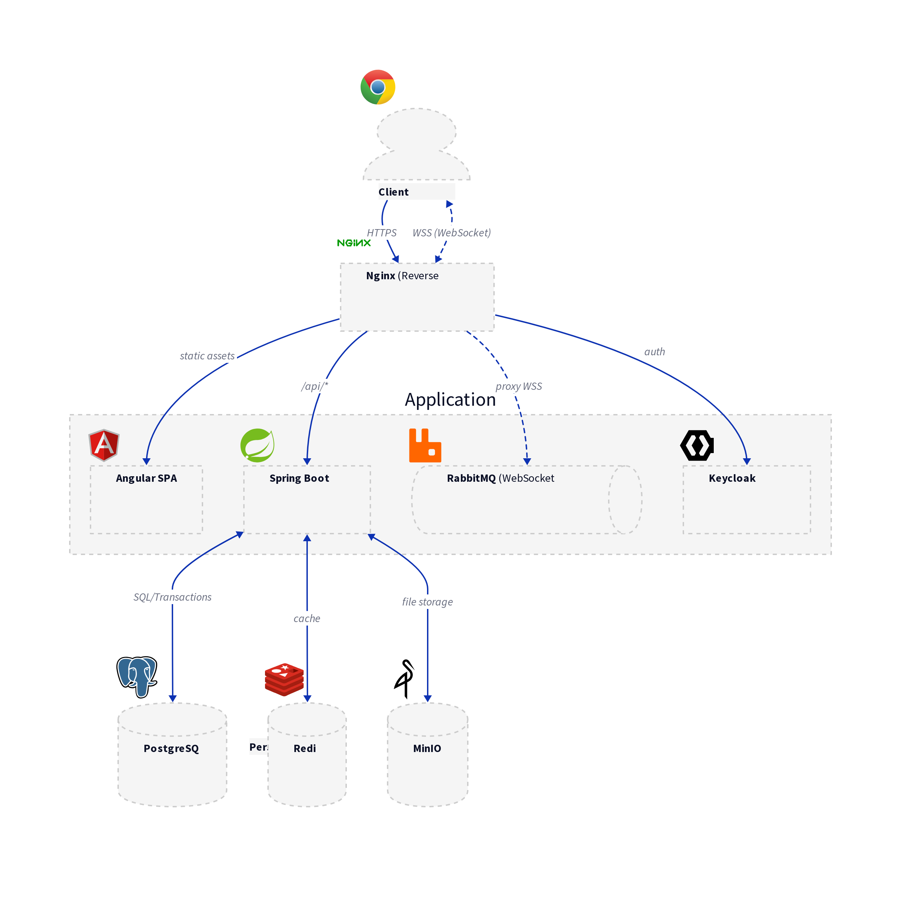


The backend follows Hexagonal Architecture (Ports & Adapters).
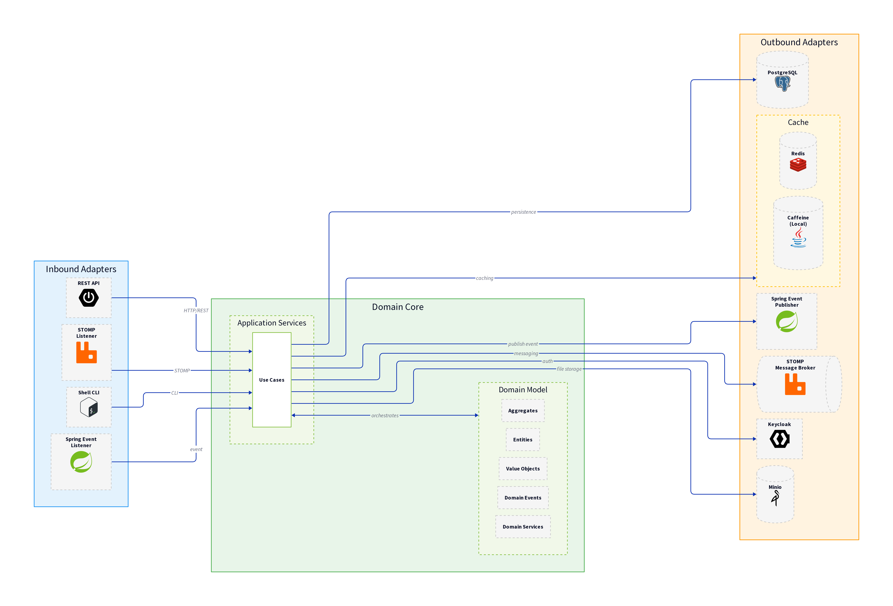


DDD domain model at the core. 
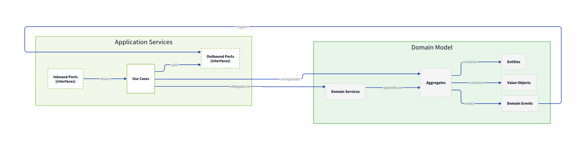

---

## Features

**Real-time messaging**  
  
1:1 chats with status tracking.

**Group messaging**  
  
Create groups, manage members, chat together.

**Media sharing**  
  
Images, video, files stored in Minio. 

**User presence tracking**  
  
See who's online in real time.

**Contact management**  

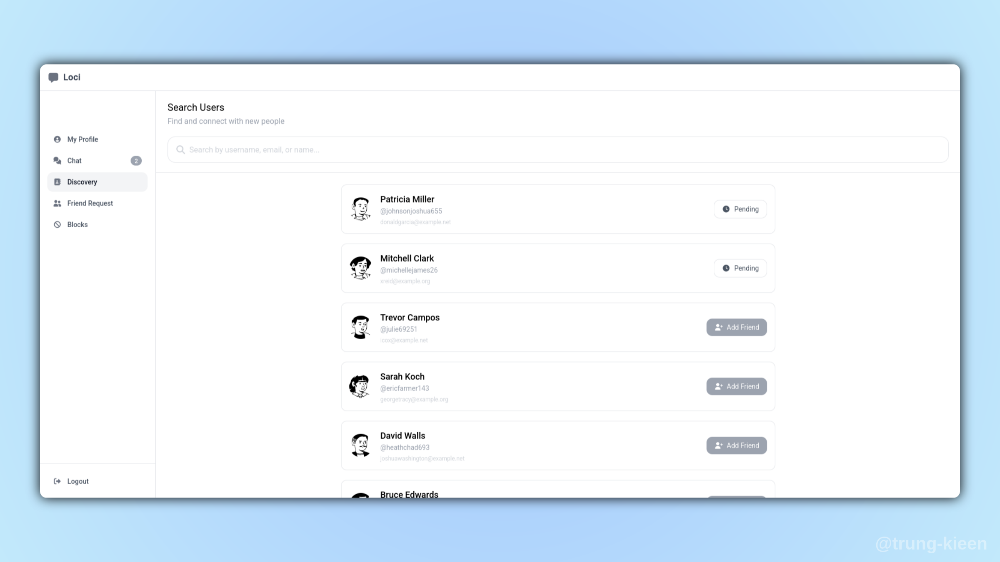  
Send and accept friend requests.

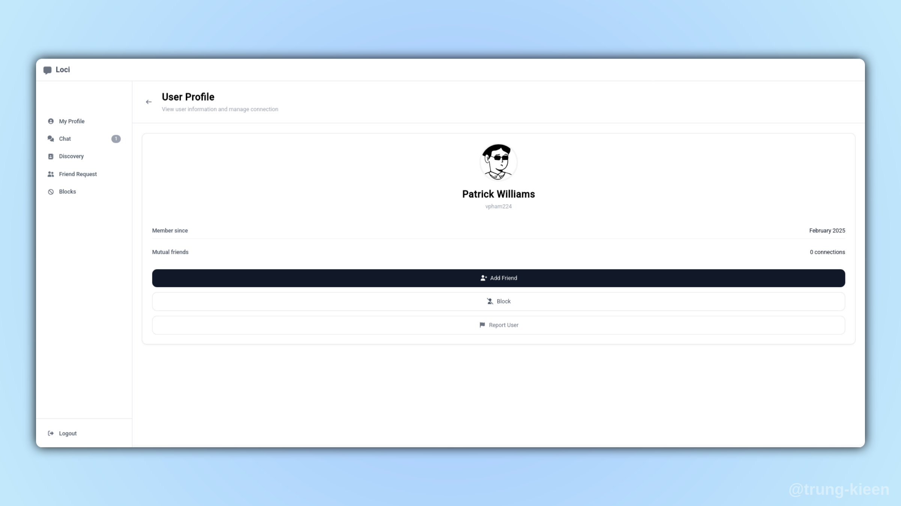  
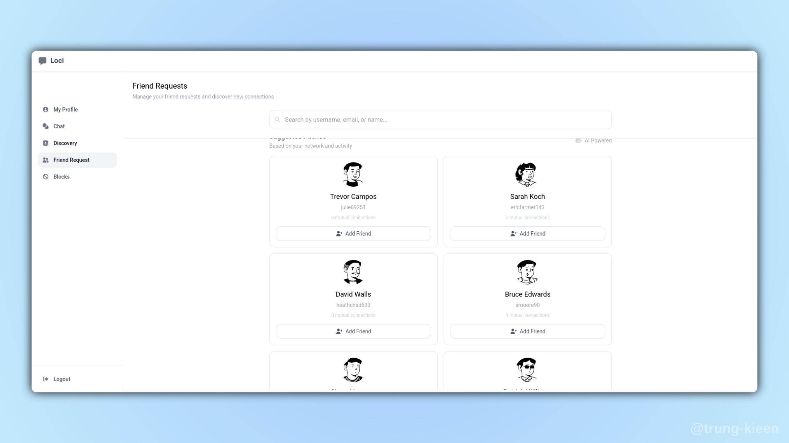  

Manage contacts and block list.

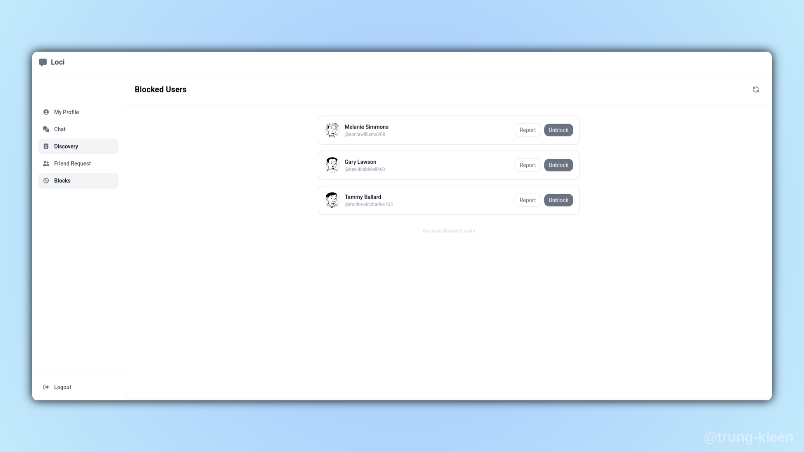

**Group management**  
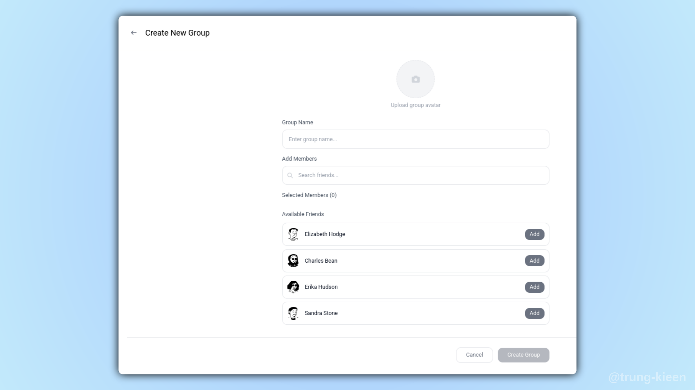  
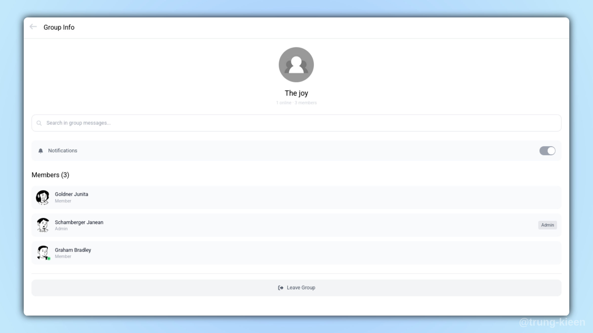

**Profile & auth**  
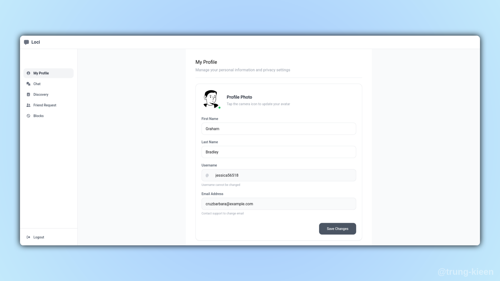  
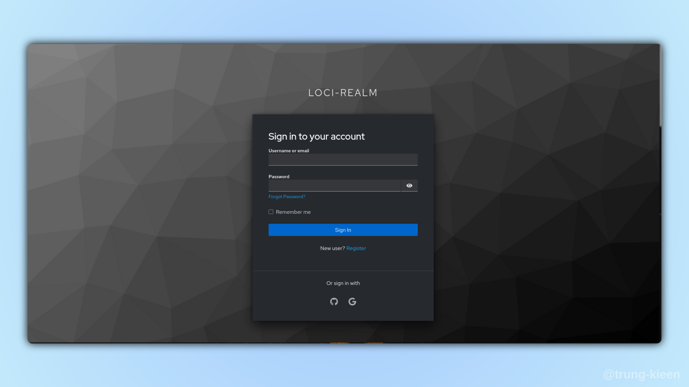  
Full authentication flow handled by Keycloak

---

## Tech

**Backend**:  Spring Boot 3, Spring Security + Keycloak,  
WebSocket/STOMP, Spring Data JPA, PostgreSQL, Minio

**Frontend**: Angular 17, RxJS, RxStomp

**DevOps**: Docker, Jenkins

---

## License

Licensed under the Apache License, Version 2.0

---

<div align="center">
  <strong>Built with ❤️& ☕ by Trung Kien</strong>
</div>
# loci_chat_videocall
